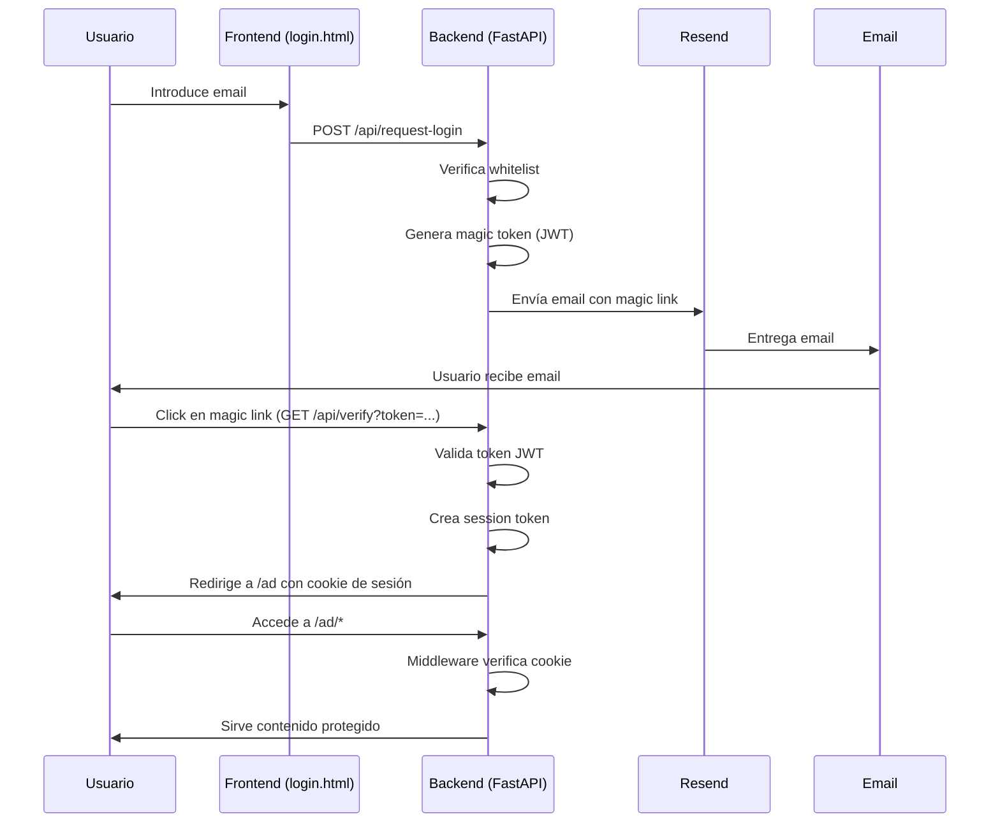

# 🔐 Sistema de Autenticación con Magic Link - FastAPI + Vercel

Sistema completo de autenticación sin contraseña usando magic links para proteger contenido estático en Vercel.

## 🎯 Características

- ✅ Autenticación sin contraseña mediante magic link
- ✅ Protección de rutas `/ad/*` con middleware
- ✅ Whitelist de emails hardcodeada (sin base de datos)
- ✅ JWT para tokens de sesión y magic links
- ✅ Envío de emails con Resend
- ✅ Cookies seguras (httpOnly, secure, sameSite)
- ✅ Desplegable en Vercel serverless

## 📁 Estructura del Proyecto

```
/
├── api/
│   └── main.py              # FastAPI backend con todos los endpoints
├── ad/
│   ├── index.html           # Página protegida (ejemplo)
│   └── ...                  # Otros archivos protegidos
├── public/
│   └── login.html           # Página de login
├── vercel.json              # Configuración de Vercel
├── pyproject.toml           # Configuración del entrypoint FastAPI
├── requirements.txt         # Dependencias Python
├── .env.example             # Variables de entorno de ejemplo
└── README.md                # Este archivo
```

## 🚀 Despliegue en Vercel

### 1. Preparación

Asegúrate de tener:
- Una cuenta en [Vercel](https://vercel.com)
- Una cuenta en [Resend](https://resend.com) para envío de emails
- Un dominio verificado en Resend (o usar el dominio de prueba)

### 2. Clonar o Inicializar el Proyecto

```bash
git clone <tu-repositorio>
cd ad-website
```

### 3. Configurar Variables de Entorno en Vercel

Ve a tu proyecto en Vercel → Settings → Environment Variables y agrega las siguientes 4 variables:

| Variable | Descripción | Ejemplo |
|----------|-------------|---------|
| `JWT_SECRET` | Clave secreta para firmar JWT (genera una aleatoria) | `your-super-secret-key-min-32-chars` |
| `RESEND_API_KEY` | API Key de Resend | `re_123abc...` |
| `BASE_URL` | URL de tu aplicación en producción | `https://tu-dominio.vercel.app` |
| `FROM_EMAIL` | Email remitente verificado en Resend | `login@tudominio.com` |

**Importante:** 
- Las variables deben configurarse en el **Dashboard de Vercel**, no en `vercel.json`
- Genera un JWT_SECRET seguro:
```bash
python -c "import secrets; print(secrets.token_urlsafe(32))"
```

### 4. Configurar Whitelist de Emails

Edita `api/main.py` y actualiza la lista `ALLOWED_EMAILS`:

```python
ALLOWED_EMAILS = [
    "usuario1@correo.com",
    "usuario2@correo.com",
    "admin@tudominio.com"
]
```

### 5. Desplegar

#### Opción A: Desde la CLI de Vercel
```bash
npm i -g vercel
vercel --prod
```

#### Opción B: Desde GitHub
1. Conecta tu repositorio con Vercel
2. Las variables de entorno se tomarán de la configuración del proyecto
3. Cada push a `main` desplegará automáticamente

### 6. Verificar Despliegue

1. Visita `https://tu-dominio.vercel.app`
2. Deberías ver la página de login
3. Intenta acceder a `https://tu-dominio.vercel.app/ad/` → debe redirigir a login
4. Solicita un magic link con un email autorizado
5. Verifica que llegue el email y haz clic en el enlace

## 🔒 Configuración de Resend

### Obtener API Key

1. Regístrate en [Resend](https://resend.com)
2. Ve a API Keys → Create API Key
3. Copia la key y agrégala como variable de entorno en Vercel

### Verificar Dominio

Para enviar desde tu propio dominio:

1. Ve a Domains en Resend
2. Agrega tu dominio
3. Configura los registros DNS (MX, TXT, CNAME) según las instrucciones
4. Espera la verificación (puede tardar hasta 48h)

**Mientras tanto:** Puedes usar el dominio de prueba `onboarding@resend.dev` para testing.

## 📧 Flujo de Autenticación



## 🔐 Seguridad

### Tokens JWT

**Magic Link Token:**
- Duración: 15 minutos
- Tipo: `magic`
- Uso único (verificado una vez)

**Session Token:**
- Duración: 7 días
- Tipo: `session`
- Almacenado en cookie httpOnly

### Cookies

Configuración de seguridad:
- `httpOnly=true` → No accesible desde JavaScript
- `secure=true` → Solo HTTPS
- `sameSite='lax'` → Protección CSRF

### Whitelist

Los emails autorizados están hardcodeados en el backend:
- No se exponen al frontend
- Se comparan en minúsculas
- No se revela si un email está o no autorizado

## 🧪 Testing Local

```bash
# 1. Crear entorno virtual
python -m venv venv
source venv/bin/activate  # En Windows: venv\Scripts\activate

# 2. Instalar dependencias
pip install -r requirements.txt

# 3. Crear archivo .env (copiar de .env.example)
cp .env.example .env

# 4. Editar .env con tus valores reales

# 5. Ejecutar servidor local
uvicorn api.main:app --reload --port 8000

# 6. Abrir navegador
# http://localhost:8000/public/login.html
```

**Nota:** En local, necesitarás configurar `secure=False` en las cookies o usar HTTPS local.

## 📝 Endpoints Disponibles

| Método | Ruta | Descripción |
|--------|------|-------------|
| POST | `/api/request-login` | Solicitar magic link |
| GET | `/api/verify?token=...` | Verificar magic link y crear sesión |
| GET | `/api/logout` | Cerrar sesión |
| GET | `/api/check-auth` | Verificar si hay sesión activa |
| GET | `/api/health` | Health check |
| GET | `/ad/*` | Contenido protegido (requiere autenticación) |

## 🔧 Personalización

### Cambiar Duración de Tokens

En `api/main.py`:

```python
# Magic link expira en 30 minutos en lugar de 15
MAGIC_LINK_EXPIRE_MINUTES = 30

# Sesión válida por 30 días en lugar de 7
SESSION_EXPIRE_DAYS = 30
```

### Personalizar Email

Edita el HTML del email en el endpoint `/api/request-login` en `api/main.py`.

### Agregar Más Páginas Protegidas

Simplemente crea archivos dentro de `/ad/`:
```
/ad/
  ├── index.html
  ├── dashboard.html
  ├── reports.html
  └── settings.html
```

Todas estarán automáticamente protegidas por el middleware.

## ⚠️ Troubleshooting

### "Error enviando email"

- Verifica que `RESEND_API_KEY` esté correctamente configurada
- Asegúrate de que el dominio del `FROM_EMAIL` esté verificado en Resend
- Revisa los logs de Vercel: `vercel logs`

### "Token inválido o expirado"

- El magic link expira en 15 minutos
- Solicita un nuevo magic link
- Verifica que `JWT_SECRET` sea la misma en todas las instancias

### "Redirección infinita a login"

- Verifica que las cookies se estén estableciendo correctamente
- En producción, asegúrate de estar usando HTTPS
- Revisa la consola del navegador para errores

### "Email no autorizado"

- Agrega el email a `ALLOWED_EMAILS` en `api/main.py`
- Redespliega la aplicación

## 📚 Tecnologías Utilizadas

- **Backend:** FastAPI (Python)
- **Autenticación:** JWT (python-jose)
- **Email:** Resend API
- **Hosting:** Vercel Serverless Functions
- **Frontend:** HTML/CSS/JavaScript vanilla

## 🤝 Contribuir

Este es un proyecto de ejemplo. Siéntete libre de adaptarlo a tus necesidades.

## 📄 Licencia

MIT License - Úsalo libremente para tus proyectos.

---

**¿Preguntas o problemas?** Abre un issue en el repositorio.
